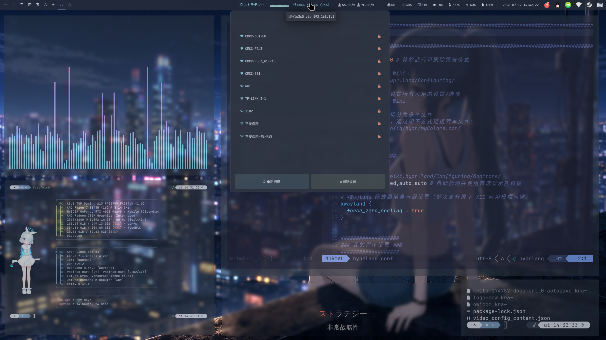
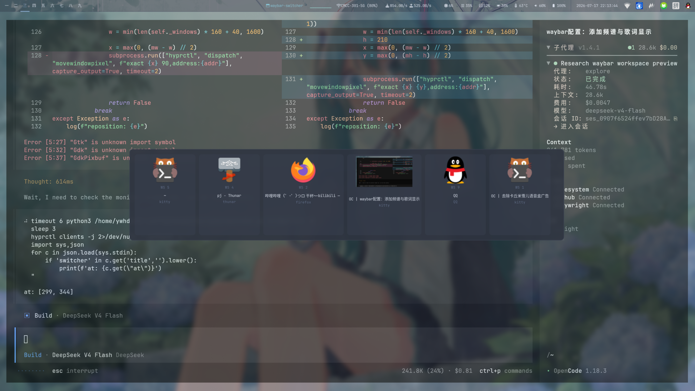
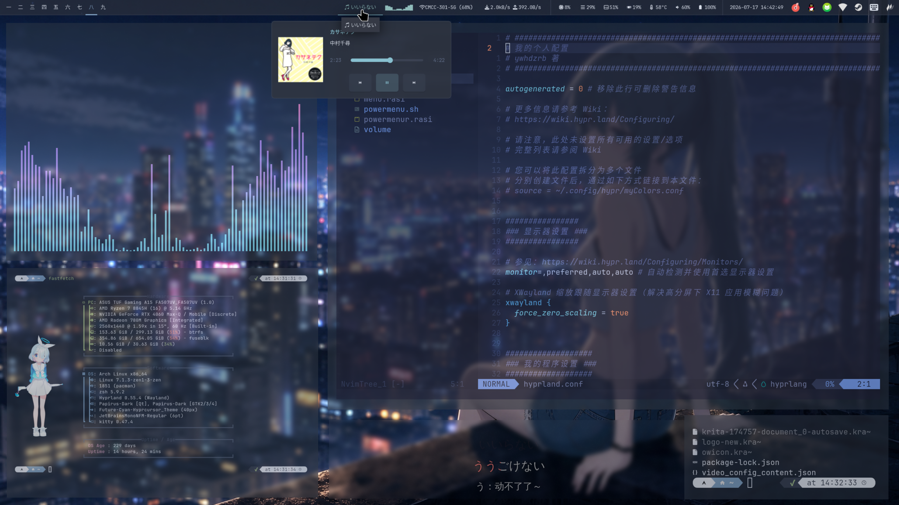

# dotfiles

Nord 主题 Hyprland 桌面配置。

## 截图

| 桌面 | Waybar 功能 |
|:---:|:---:|
|  |  |
| **Rofi 菜单** | **Alt+Tab 切换** |
|  |  |

## 快速安装

```bash
git clone https://github.com/ywhdzrb/dotfiles ~/dotfiles
cd ~/dotfiles
./install.sh
```

## 功能一览

| 模块 | 说明 |
|------|------|
| **Hyprland** | 滚动布局，1px 渐变边框，模糊/圆角/阴影 |
| **Waybar** | 音乐卡片/歌词/频谱/网络/硬件监控 |
| **Rofi** | 应用启动器 + 窗口切换 + 剪贴板 + 电源菜单 |
| **Kitty** | 半透明终端，Nord 配色，自动建议 |
| **Dunst** | 右上角通知，Nord 主题 |
| **壁纸** | Linux Wallpaper Engine + Steam Workshop |
| **截图** | Flameshot（冻结+画笔标注） |
| **OCR** | Super+Shift+O 选区识别文字 |
| **GTK/Qt** | Nordic + KvSimplicityDark 全局主题 |
| **手势** | 三指左右滑切换工作区 |

## 快捷键

| 快捷键 | 功能 |
|--------|------|
| `Super+Return` | 打开 Kitty 终端 |
| `Super+D` | Rofi 应用启动器 |
| `Super+Q` | 关闭窗口 |
| `Super+Shift+Q` | 强制关闭 |
| `Super+W` | 关闭当前工作区 |
| `Super+Tab` | 窗口切换预览 |
| `Alt+Tab` | GTK 窗口切换器（缩略图） |
| `Super+Shift+S` | 截图（Flameshot） |
| `Super+Shift+O` | OCR 文字识别 |
| `Super+1-9` | 切换工作区 |
| `Super+S` | 切换浮动/平铺 |
| `Super+F` | 全屏 |
| `Super+,/.` | 左右移动窗口 |
| `Ctrl+Shift+Space` | 补全弹窗 |
| `三指左右滑` | 切换工作区 |

## 目录结构

```
.config/
├── hypr/              # Hyprland 配置
├── waybar/            # 状态栏 + 脚本
├── kitty/             # 终端配色
├── dunst/             # 通知中心
├── qt5ct/ qt6ct/ Kvantum/  # Qt 主题
├── gtk-3.0/ gtk-4.0/       # GTK 主题
├── hyprswitch/        # 窗口切换器
├── libinput-gestures/ # 触摸板手势
└── environment.d/     # Qt 环境变量
wallpaper/
├── 16.png             # 静态壁纸
└── steam-workshop/    # Steam Workshop 壁纸
.zshrc                 # Zsh 配置
.secrets.example       # 密钥模板
packages.txt           # 依赖列表
install.sh             # 安装脚本
```

## 依赖

见 `packages.txt`。安装方式：

```bash
yay -Sa --noconfirm $(grep -v '^#' packages.txt)
```

## Zinit

Zsh 插件管理器，用于加载补全/高亮/建议等：

```bash
bash -c "$(curl -fsSL https://git.io/zinit-install)"
```

安装后重新打开终端，插件会自动下载。也可手动安装：

```bash
git clone https://github.com/zdharma-continuum/zinit ~/.local/share/zinit/zinit.git
```

## 密钥

将 `ANTHROPIC_AUTH_TOKEN` 填入 `~/.secrets`：

```bash
cp .secrets.example ~/.secrets
# 编辑 ~/.secrets 填入密钥
```
